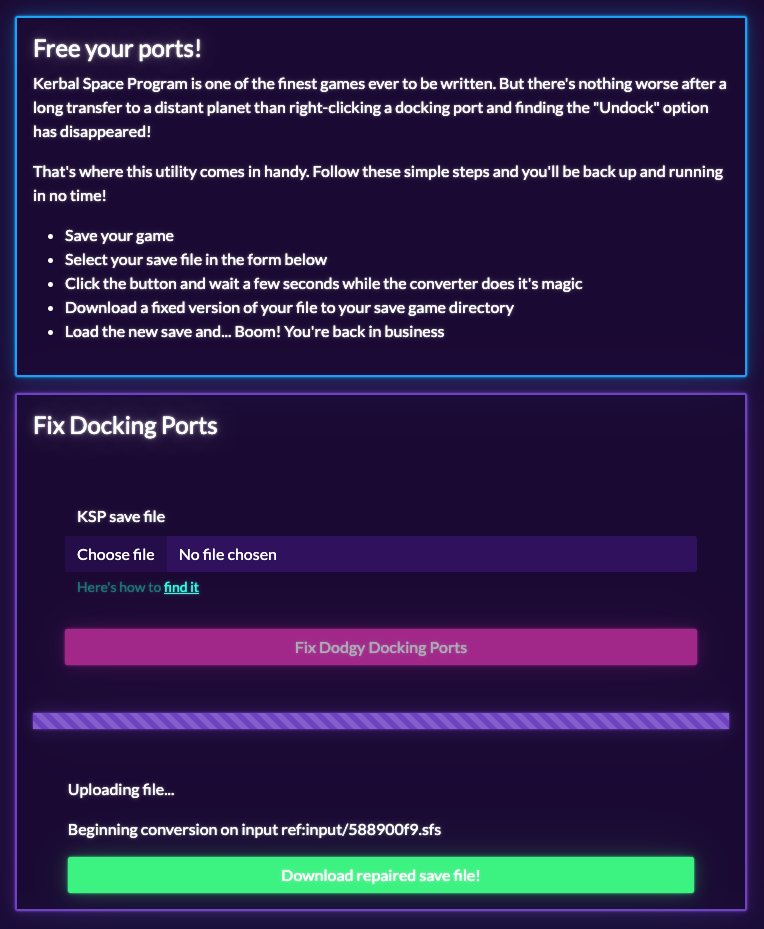
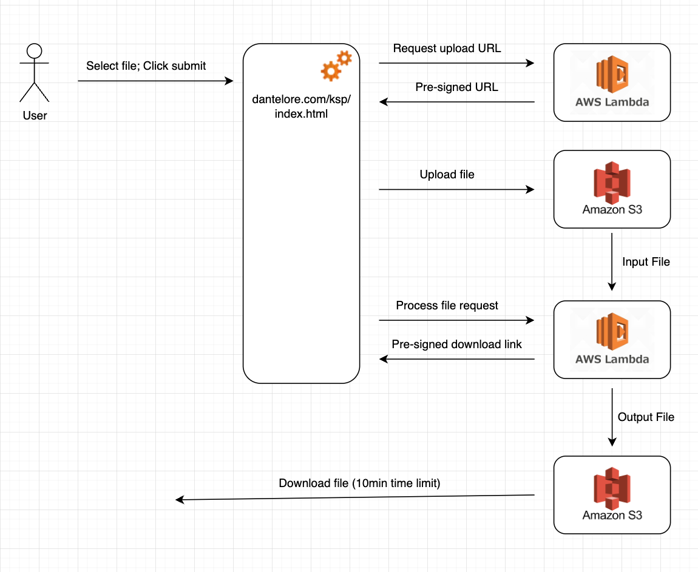

# Kerbal Space Program Utils

A selection of utils for manipulating save files from the finest game ever developed: Kerbal Space Program 1

Kerbal Space Program is one of the finest games ever to be written. But there's nothing worse after a long transfer to a distant planet than right-clicking a docking port and finding the "Undock" option has disappeared!

That's where this utility comes in handy.

* Save your game
* Select your save file in the form below
* Click the button and wait a few seconds while the converter does it's magic
* Download a fixed version of your file to your save game directory
* Load the new save and... Boom! You're back in business

Find the tool online at: [http://dantelore.com/ksp/]

## The tech

The project is a demo of how S3 and Lambda can be used to create a file processing workflow which works with very large
(multi-megabyte) files.  

The flow is shown here:

